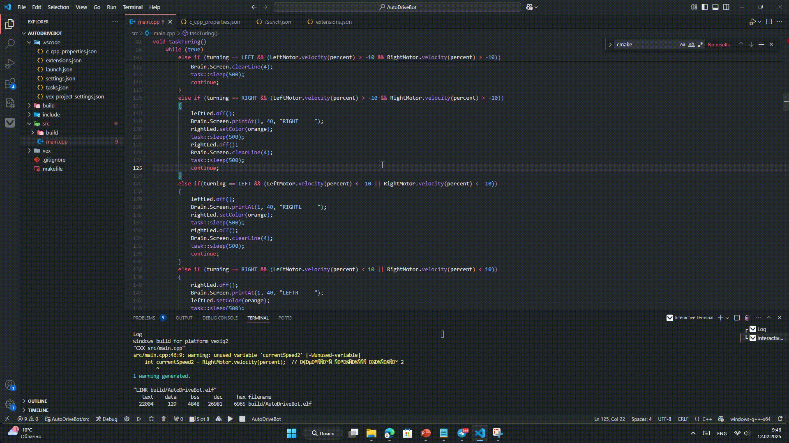

# Проект AutoDriveBot
Добро пожаловать в репозиторий проекта **AutoDriveBot!**

Наш проект помогает будущим водителям и преподавателям автошкол сделать процесс обучения более наглядным и эффективным.

## О проекте
*AutoDriveBot* — это автоматизированная конструкция с поворотным механизмом, способная имитировать основные функции настоящего автомобиля.

*TLTC* — это программа на ПК которая поможет в обучении путём подсказок и упровления роботом.

## Проблема и её решение
Мы рассматриваем информацию сдачи экзамена в г. Чите. По данным сайта [zab.ru](https://zab.ru/) , сдают экзамен с первого раза только 7,7% кандидатов в водители. Виной тому качество подготовки учеников в образовательных учреждениях. Численность обучающихся растёт, однако качество их подготовки снижается.

Проект будет внедрен в учебных заведениях, проводящих подготовку водителей. В автошколе два курса: теоретический и практический, поэтому мы хотим внедрить наш проект в теоретический курс. Учащиеся будут знако-миться со строением автомобиля, а наш проект будет использоваться на пер-вых занятиях. Помимо иллюстрирования конкретной дорожной ситуации на доске преподаватель может показывать ее с помощью нашего проекта. Так мы получаем более конкретный вид на ситуацию со стороны.  

## License
Этот проект лицензирован по лицензии MIT. Подробнее о лицензии: [LICENSE](https://github.com/ogled/AutoDriveBot/edit/main/LICENSE)

## Устоновка программы работа
### 1.  Устоновка Git
Если Git ещё не установлен:
```bash
winget install --id Git.Git -e --source winget
```
### 2.  Клонирование репозитория
```bash
git clone --filter=blob:none --no-checkout https://github.com/ogled/AutoDriveBot.git
cd AutoDriveBot

git sparse-checkout init --cone
git sparse-checkout set Robot
```
### 3.  Устоновка VS CODE
```bash
winget install --id Microsoft.VisualStudioCode -e --source winget
```
### 4.  Устоновка расширений
```bash
code --install-extension ms-vscode.cpptools
code --install-extension VEXRobotics.vexfeedback
code --install-extension VEXRobotics.vexcode
```
### 5.  Открытие
```bash
code .
```
### 6.  Сборка


